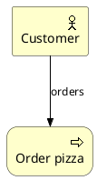

```rockuml tldr
@startuml
archimate #Business "Fan" as Fan <<business-actor>>
archimate #Business "Buy a ticket" as Buy <<business-process>>
archimate #Business "Ticket" as Ticket <<business-object>>
archimate #Application "Box office app" as App <<application-component>>
archimate #Application "Seat booking" as Booking <<application-service>>
archimate #Technology "Stark cloud" as Cloud <<technology-node>>

Fan --> Buy
Buy --> Ticket
Buy --> Booking
Booking --> App
App --> Cloud
@enduml
```

ArchiMate is the modelling language of enterprise architects: it connects business processes, the applications that support them and the technology they run on, each layer with its own colour and icons. rockuml draws ArchiMate elements with `archimate`, a colour for the layer, and a stereotype for the kind of element.

## Elements

An element is `archimate #Layer "Name" as alias <<kind>>`. The layer colours are `#Business`, `#Application`, `#Technology`, `#Physical`, `#Motivation`, `#Strategy` and `#Implementation`, and the kind chooses the icon in the corner.

```rockuml
@startuml
archimate #Business "Planet Express" as PE <<business-actor>>
archimate #Business "Delivery boy" as Role <<business-role>>
archimate #Business "Deliver packages" as Deliver <<business-process>>
archimate #Business "Delivery service" as Service <<business-service>>
archimate #Business "Package" as Package <<business-object>>
PE --> Role
Role --> Deliver
Deliver --> Service
Deliver --> Package
@enduml
```

### Application layer

```rockuml
@startuml
archimate #Application "Hooli Mail" as Mail <<application-component>>
archimate #Application "Mail API" as API <<application-interface>>
archimate #Application "Spam filter" as Filter <<application-function>>
archimate #Application "Inbox" as Inbox <<data-object>>
archimate #Application "Search" as Search <<application-service>>
API --> Mail
Mail --> Filter
Filter --> Inbox
Mail --> Search
@enduml
```

### Technology layer

```rockuml
@startuml
archimate #Technology "Mainframe" as Box <<technology-device>>
archimate #Technology "Pied Piper OS" as OS <<technology-system-software>>
archimate #Technology "Peer-to-peer network" as Net <<technology-communication-network>>
archimate #Technology "Compression" as Svc <<technology-service>>
archimate #Technology "pipernet.bin" as Art <<technology-artifact>>
Box --> OS
Box --> Net
OS --> Svc
Svc --> Art
@enduml
```

### Motivation, strategy and implementation

```rockuml
@startuml
archimate #Motivation "Nick Fury" as Fury <<motivation-stakeholder>>
archimate #Motivation "Protect the Earth" as Goal <<motivation-goal>>
archimate #Motivation "Fewer alien invasions" as Outcome <<motivation-outcome>>
archimate #Strategy "Assemble heroes" as Capability <<strategy-capability>>
archimate #Implementation "Avengers Initiative" as Initiative <<implementation-workpackage>>
Fury --> Goal
Goal --> Outcome
Outcome --> Capability
Capability --> Initiative
@enduml
```

## Grouping

An element with braces contains other elements, such as a collaboration and its parts. Any rectangle can also carry an ArchiMate icon with the sprite stereotype `<<$archimate/kind>>`:

```rockuml
@startuml
archimate #Business "Fellowship of the Ring" as Fellowship <<business-collaboration>> {
  archimate #Business "Frodo" as Frodo <<business-actor>>
  archimate #Business "Destroy the Ring" as Quest <<business-event>>
}
rectangle "Mordor" as Mordor <<$archimate/technology-node>> #Technology
Quest --> Mordor
@enduml
```

## Relations

Elements connect with the usual arrows, labels and styles. The ArchiMate relation macros of PlantUML's standard library (`Rel_Serving` and friends) need the library, which the `rockuml` binary has and this browser build doesn't; plain arrows work everywhere:

```rockuml
@startuml
archimate #Business "Customer" as C <<business-actor>>
archimate #Business "Order pizza" as O <<business-process>>
archimate #Application "Pizza Planet app" as A <<application-component>>
C --> O : triggers
A ..> O : serves
@enduml
```


