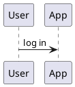

```rockuml tldr
@startuml
title Planet Express: delivery #1
header Confidential
footer Page 1
caption Figure 1: a routine delivery

actor Fry
participant Bender
Fry -> Bender : grab the package
Bender --> Fry : bite my shiny metal…
note right of Bender : he grabs it anyway

legend right
  Crew of the Planet Express ship
  ----
  Ship: Planet Express Ship
endlegend
@enduml
```

Every diagram type has its own vocabulary, but they share a frame: a title above, a header and footer at the edges, a caption under the diagram and a legend beside it. This page covers that frame, plus comments, scaling and splitting a diagram over several pages. Everything here works in every diagram type, from sequence diagrams to Gantt charts.

## Title

`title` puts a title above the diagram. For a title of several lines, write them between `title` and `end title`:

```rockuml
@startuml
title
  The Simpsons' Nuclear Power Plant
  <i>sector 7G, as seen by the inspector</i>
end title

class Homer {
  safetyInspector : boolean = true
  donutsEaten : int
  sleep()
}
class Reactor
Homer --> Reactor : watches (sort of)
@enduml
```

The title takes [text formatting](docs/creole): bold, italics, colours, even small tables. A `\n` in a one-line title starts a new line.

## Header and footer

`header` and `footer` print a line at the top and the bottom of the image, on the right unless you say `left`, `center` or `right`. Like the title, they have a multi-line form ending in `endheader` or `endfooter`.

```rockuml
@startuml
left header
  Wayne Enterprises
  <b>Classified</b>
endheader
center footer Generated by rockuml, which is not Batman

Bruce -> Alfred : Where's the car?
Alfred --> Bruce : In the cave, sir.
@enduml
```

## Caption

`caption` writes a line under the diagram, the way figures are captioned in a book:

```rockuml
@startuml
caption Figure 3: the One Ring's change of ownership
Sauron -> Isildur : loses the Ring
Isildur -> Gollum : loses it in the river
Gollum -> Bilbo : riddles in the dark
Bilbo -> Frodo : inherits it
@enduml
```

## Legend

A legend explains the diagram in a framed box, by default centred under it. Put `left`, `right` or `center` after `legend` to move it sideways and `top` or `bottom` to move it vertically, as in `legend top left`. A legend of one line fits on the `legend` line itself; longer legends end with `endlegend`. Inside, the [separators](docs/creole#separators) `----`, `====` and `== Title ==` divide it into parts.

```rockuml
@startuml
actor Steve
participant Creeper
Steve -> Creeper : hits with a sword
Creeper -> Creeper : hisses
Creeper --> Steve : boom

legend top left
  <b>Minecraft survival tips</b>
  ----
  Creepers explode near you
  Keep a sword at hand
  == At night ==
  Stay indoors
endlegend
@enduml
```

## Comments

A line starting with an apostrophe (`'`) is a comment, and `/'` starts a comment that lasts until `'/`, over as many lines as you like. Comments are dropped before anything else happens, so they can hold anything.

```rockuml
@startuml
' The crew of the Going Merry
Luffy -> Zoro : we're going to the Grand Line!
/' Zoro got lost on the way,
   which is why this arrow is missing:
Zoro -> Nami : where is the ship? '/
Nami -> Luffy : give me a map and I'll get us there
@enduml
```

## Scale

`scale` resizes the whole image: by a factor (`scale 1.5`, `scale 2/3`), to a width or height in pixels (`scale 400 width`, `scale 200 height`, or both as `scale 400*200`), or only when the image would be bigger than a limit (`scale max 300 width`).

```rockuml
@startuml
scale 0.7
Naruto -> Sasuke : come back to the village!
Sasuke --> Naruto : no
Naruto -> Naruto : believe it
@enduml
```

```rockuml
@startuml
scale max 260 width
Thor -> Loki : is this another trick?
Loki --> Thor : would I trick you?
Thor -> Thor : every single time
@enduml
```

`skinparam dpi 150` has a similar effect on images: PlantUML assumes 96 dots per inch, and a higher resolution makes a larger, sharper PNG.

## Several pages

In sequence diagrams, `newpage` ends a page and starts the next one. The command line writes each page into its own file (`diagram.png`, `diagram_001.png`, and so on); on this site the [playground](playground) lets you flip through them. A title after `newpage` names the new page.

```rockuml
@startuml
Rick -> Morty : Get in, Morty
Morty -> Rick : where are we going?
newpage Part two: the portal
Rick -> Portal : open
Portal --> Morty : wubba lubba dub dub
@enduml
```

## Several diagrams in one file

A file can hold any number of diagrams, each between its own start and end lines. Name a diagram by putting the name after the start line, `@startuml checkout`, and the command line writes it to `checkout.png` instead of numbering it.



## Mixing diagram types

Within `@startuml`, rockuml finds out from the first lines what kind of diagram you are writing. When a class diagram suddenly contains a sequence message, or the other way around, it reports a syntax error and shows you the line. Class, use case, component, deployment, object and state elements, however, can be mixed in one diagram: [component diagrams](docs/component) routinely hold actors, and with `allowmixing` [class diagrams](docs/class#mixing-in-other-elements) hold components and actors too.
