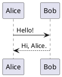

```rockuml tldr
@startuml
title My first diagram
actor User
participant "My app" as App
database Storage

User -> App : does something
App -> Storage : saves it
Storage --> App : done
App --> User : all good
@enduml
```

rockuml draws diagrams from text. You describe *what* is in the diagram, people and boxes and arrows, and rockuml works out *where* everything goes. It understands the language of [PlantUML](https://plantuml.com), so the thousands of diagrams already written for PlantUML work with rockuml as they are.

What makes rockuml different is how it runs: it is written in Rust and ships as one binary per platform. There is no Java to install, no Graphviz to find and no server to call. Every example on this site is drawn by the same engine, compiled to WebAssembly, right inside your browser. Edit any of them: the diagram follows as you type.

## Install

Download the binary for your platform from the [releases page](https://github.com/h3ll5ur7er/rockuml/releases) and put it somewhere on your `PATH`:

| Platform | File |
|---|---|
| Windows (x64) | `rockuml.exe` |
| Linux (x64, any distribution) | `rockuml-linux-x86_64` |
| macOS (Apple silicon and Intel) | `rockuml-macos-universal` |

On Linux and macOS, rename it to `rockuml` and make it executable:

```bash
mv rockuml-linux-x86_64 ~/.local/bin/rockuml
chmod +x ~/.local/bin/rockuml
rockuml --version
```

To build it yourself you need a Rust toolchain, nothing else:

```bash
git clone https://github.com/h3ll5ur7er/rockuml
cd rockuml
cargo install --path crates/rockuml-cli
```

## Your first diagram

Save this as `hello.puml`:



Then draw it:

```bash
rockuml hello.puml            # writes hello.png next to it
rockuml --svg hello.puml      # writes hello.svg instead
```

That is the whole workflow. rockuml takes the same command line as PlantUML, so scripts and build tools that call `plantuml` keep working when they call `rockuml`. The [command line page](docs/cli) has every flag.

## The shape of a source

Every diagram sits between a start line and an end line. `@startuml` and `@enduml` cover most diagrams; rockuml looks at the lines in between to decide whether you wrote a sequence diagram, a class diagram, an activity diagram, and so on. Some diagram types have their own start line:

| Diagram | Starts with |
|---|---|
| Sequence, use case, class, object, activity, component, deployment, state, timing, ArchiMate | `@startuml` |
| Entity relationships | `@startchen` |
| Mind maps | `@startmindmap` |
| Work breakdown structures | `@startwbs` |
| Gantt charts | `@startgantt` |
| JSON and YAML data | `@startjson`, `@startyaml` |
| Network diagrams | `@startnwdiag` |
| Wireframes | `@startsalt` |
| Formatted text | `@startcreole` |

A file can hold several diagrams one after the other; rockuml draws each into its own image. Text outside the start and end lines is ignored, so you can keep notes around your diagrams.

Lines starting with an apostrophe are comments, and `/'` … `'/` comments out a block:

```rockuml
@startuml
' Nobody reads this line.
Marvin -> Arthur : Life. Don't talk to me about life.
/' Nor this one,
   or this one. '/
Arthur -> Marvin : Sorry I asked.
@enduml
```

## Where to go next

- Pick a diagram type from the list on the left. Every page starts with a **TL;DR** template you can copy, then walks through everything that diagram can do.
- [Common commands](docs/basics) covers what all diagrams share: titles, notes, legends, scaling and pages.
- [Text formatting](docs/creole), [Colours and styles](docs/styling) and [Themes](docs/themes) make diagrams look the way you want.
- The [playground](playground) is a full-screen editor whose address bar is a shareable link to your diagram.
- Use rockuml from your editor with the [server](docs/server), or from your own web pages with the [JavaScript API](docs/javascript) and the [Angular components](docs/angular).

> **Good to know:** the examples on this site run in your browser, which has no files, so `!include` of local files does not work here, and the standard library and emoji are left out of the browser build to keep it small. The `rockuml` binary has all of them. See [Compatibility](docs/compatibility) for the details.
