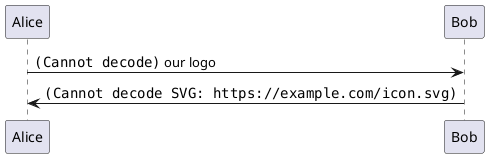
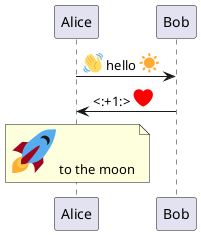
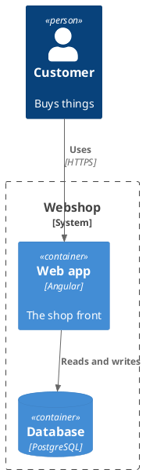

```rockuml tldr
@startuml
sprite $creeper [8x8/16] {
AAAAAAAA
A00AA00A
A00AA00A
AAA00AAA
AA0000AA
AA0000AA
AA0AA0AA
AAAAAAAA
}
participant "<$creeper> Creeper" as C
participant "<&person> Steve" as S
C -> S : <$creeper*2> sss…
S -> C : <&shield> blocks
@enduml
```

Diagrams can show more than boxes and text: small pictures called sprites, any image, the icons of the Open Iconic set, and emoji. All of them go inside texts, wherever [creole](docs/creole) works.

## Sprites

A sprite is a small picture defined in the diagram itself and used as `<$name>`. The simplest kind is a grid of grey levels, one hexadecimal digit (`0` to `F`) per pixel:

```rockuml
@startuml
sprite $invader {
  00F00000F00
  000F000F000
  00FFFFFFF00
  0FF0FFF0FF0
  FFFFFFFFFFF
  F0FFFFFFF0F
  F0F00000F0F
  000FF0FF000
}
Player -> Earth : <$invader> they're here
Earth --> Player : <$invader><$invader><$invader>
@enduml
```

The size and depth in brackets, such as `[16x16/16]`, `[16x16/8]` or `[16x16/4]`, allow fewer grey levels per character; `[8x8/color]` takes a colour per character. Sprites also come in other formats:

- an SVG image: `sprite $name <svg viewBox="0 0 20 20">…</svg>`;
- a PNG as a data URI: `sprite $name data:image/png;base64,…`;
- compressed text made by `rockuml --sprite 16 image.png` (with `z` in the brackets, `[16x16/16z]`).

```rockuml
@startuml
sprite $pokeball <svg viewBox="0 0 20 20">
  <circle cx="10" cy="10" r="9" fill="#EE1515"/>
  <path d="M1 10h18v1a9 9 0 0 1-18 0z" fill="white"/>
  <circle cx="10" cy="10" r="3" fill="white" stroke="black" stroke-width="1.5"/>
</svg>
Ash -> Pikachu : <$pokeball> I choose you!
@enduml
```

### Size and colour

`<$name*2>` or `<$name{scale=0.5}>` scales a sprite, and `<#red$name>` or `<$name{color=blue}>` colours it.

```rockuml
@startuml
sprite $heart [9x8/16] {
0FF000FF0
FFFF0FFFF
FFFFFFFFF
FFFFFFFFF
0FFFFFFF0
00FFFFF00
000FFF000
0000F0000
}
Link -> Zelda : <$heart> <$heart*2> <#red$heart{scale=3}>
Zelda --> Link : <$heart{scale=2,color=green}> it's dangerous to go alone
@enduml
```

### Sprites as stereotypes

A sprite in a stereotype, `<< $name >>`, becomes the icon of an element:

```rockuml
@startuml
sprite $ring [9x9/16] {
000FFF000
00F000F00
0F00000F0
F0000000F
F0000000F
F0000000F
0F00000F0
00F000F00
000FFF000
}
rectangle "The One Ring" << $ring >>
rectangle "Frodo" as F
F --> "The One Ring" : carries
@enduml
```

## ArchiMate icons

rockuml has the ArchiMate icons built in, as sprites named `archimate/…`. The [ArchiMate page](docs/archimate) shows them in their natural habitat.

```rockuml
@startuml
Architect -> Board : <$archimate/business-actor> stakeholders
Board -> Architect : <$archimate/business-process> processes <$archimate/node*2>
@enduml
```

## Open Iconic

`<&name>` draws one of the 223 icons of [Open Iconic](https://github.com/iconic/open-iconic): `<&heart>`, `<&star>`, `<&cloud>`, `<&lock-locked>`, `<&wifi>`, `<&code>`, `<&bug>`, and many more. They scale with `*2` or `{scale=…}` and take the colour of their text.

```rockuml
@startuml
rectangle "<&bug*2> Bugs" as Bugs
rectangle "<&wrench*2> Fixes" as Fixes
rectangle "<&check*2> <color:green>Done</color>" as Done
Bugs --> Fixes : <&people> devs
Fixes --> Done : <&clock> eventually
@enduml
```

## Images

`` puts an image file in a text: PNG, JPEG, GIF and SVG, read relative to the diagram's file. `` loads one from the web, and `{scale=2}` scales it. Files and URLs need the `rockuml` binary; in the browser, a data URI works:

```rockuml
@startuml
participant Robot
Robot -> Robot :  beep boop
@enduml
```



For safety, like PlantUML, rockuml refuses system paths such as `/etc/` unless the `PLANTUML_SECURITY_PROFILE` environment variable allows them.

## Emoji

`<:name:>` draws an emoji by its name or code point: `<:smile:>`, `<:rocket:>`, `<:1f600:>`. A colour in front, `<#green:heart:>`, draws it in one colour. Emoji are part of the `rockuml` binary, and left out of the browser build to keep it small, so this example only renders on your machine:



## The standard library

The standard library brings thousands of ready-made sprites and macros: cloud icons for AWS, Azure and Google Cloud, Kubernetes, Office, C4 models, and more. `!include <library/file>` pulls them in. Like emoji, the library is part of the `rockuml` binary only:



[THIRD-PARTY.md](https://github.com/h3ll5ur7er/rockuml/blob/main/THIRD-PARTY.md) lists the libraries rockuml carries, with their versions and licenses.
